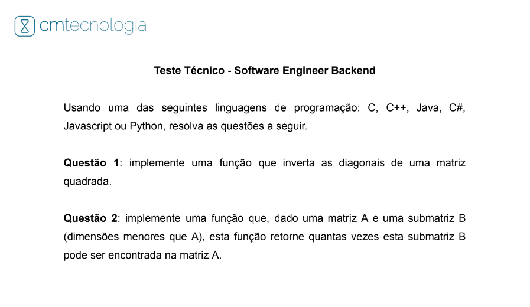

# [CM Tecnologia](https://cmtecnologia.com.br/) 

#### Segunda parte do Teste Técnico para o processo seletivo da vaga de Software Engineer Backend

#### Recursos utilizados: 
**Editor de código-fonte:** Visual Studio Code 
**Linguagem de programação:** Java
**Plataforma de hospedagem de código-fonte e arquivos com controle de versão usando o Git:** GitHub

#### Desafios de código:

#### Candidata: [Ana Karine R. P. Moreira](https://www.linkedin.com/in/moreirakarine/)